# Multi-Modal AI Processing Guide

> **Advanced AI-Powered Document Intelligence with Cross-Modal Understanding**
> 
> **Capabilities**: Image Analysis | Chart Interpretation | Cross-Modal Search | **Status**: Production Ready

---

## 📋 Table of Contents

1. [Multi-Modal Intelligence Overview](#multi-modal-intelligence-overview)
2. [AI Models & Technologies](#ai-models--technologies)
3. [Image Processing Pipeline](#image-processing-pipeline)
4. [Chart & Visualization Analysis](#chart--visualization-analysis)
5. [Cross-Modal Search System](#cross-modal-search-system)
6. [Confidence Scoring & Quality](#confidence-scoring--quality)
7. [Integration with RAG System](#integration-with-rag-system)
8. [Performance & Optimization](#performance--optimization)
9. [Use Cases & Examples](#use-cases--examples)
10. [Configuration & Customization](#configuration--customization)

---

## Multi-Modal Intelligence Overview

### 🧠 What is Multi-Modal RAG?

Multi-Modal RAG extends traditional text-based Retrieval-Augmented Generation to include **visual content understanding**, enabling the system to analyze, interpret, and search across text, tables, images, and charts simultaneously.

#### 🎯 Core Capabilities
```yaml
Visual Intelligence:
  ✅ AI-powered image captioning and description
  ✅ Object detection and classification (90+ object types)
  ✅ Chart and graph data extraction
  ✅ Technical diagram interpretation
  ✅ OCR with preprocessing and enhancement

Cross-Modal Understanding:
  ✅ Unified search across text, tables, and images
  ✅ Contextual relationships between modalities
  ✅ Semantic linking of visual and textual content
  ✅ Multi-modal question answering

Content Integration:
  ✅ Rich document representations with all content types
  ✅ Coordinated processing across extraction methods
  ✅ Unified confidence scoring and quality assessment
  ✅ Comprehensive document intelligence
```

#### 🏗️ Multi-Modal Architecture

```mermaid
graph TB
    subgraph "Input Layer"
        A[📄 Document] --> B[🔍 Content Detection]
        B --> C{Content Type Router}
    end
    
    subgraph "AI Processing Layer"
        C -->|Images| D[🤖 BLIP Captioning]
        C -->|Objects| E[🎯 DETR Detection]
        C -->|Text in Images| F[📝 Tesseract OCR]
        C -->|Tables| G[📊 Table Intelligence]
        C -->|Charts| H[📈 Chart Analysis]
        
        D --> I[🧠 Multi-Modal Element Store]
        E --> I
        F --> I
        G --> I
        H --> I
    end
    
    subgraph "Intelligence Layer"
        I --> J[🔗 Cross-Modal Linking]
        I --> K[📊 Confidence Scoring]
        I --> L[🔍 Semantic Embedding]
        
        J --> M[🌐 Unified Knowledge Graph]
        K --> M
        L --> M
    end
    
    subgraph "Query Layer"
        N[❓ Multi-Modal Query] --> O[🔍 Hybrid Search]
        O --> P[📝 Text Search]
        O --> Q[🖼️ Image Search]
        O --> R[📊 Table Search]
        
        M --> P
        M --> Q
        M --> R
    end
    
    subgraph "Response Layer"
        P --> S[🎯 Result Fusion]
        Q --> S
        R --> S
        S --> T[💬 Rich Multi-Modal Response]
    end
    
    style A fill:#e1f5fe
    style I fill:#fff3e0
    style M fill:#f3e5f5
    style T fill:#c8e6c9
```


---

## AI Models & Technologies

### 🤖 Core AI Models

#### 1. **BLIP (Bootstrapping Language-Image Pre-training)**
```python
model_profile = {
    "name": "BLIP Image Captioning",
    "model_id": "Salesforce/blip-image-captioning-base",
    "primary_function": "Generate descriptive captions for images",
    "accuracy": "High for general images, very good for charts and diagrams",
    
    "strengths": [
        "Excellent at describing visual content in natural language",
        "Strong performance on charts, graphs, and diagrams", 
        "Good contextual understanding of business and technical content",
        "Relatively fast inference speed"
    ],
    
    "use_cases": [
        "Document image description",
        "Chart and graph interpretation",
        "Technical diagram analysis",
        "Visual content summarization"
    ],
    
    "example_outputs": {
        "bar_chart": "A bar chart showing quarterly sales performance with values ranging from $1.2M to $2.8M across Q1-Q4 2024",
        "technical_diagram": "A system architecture diagram depicting data flow between API gateway, application servers, and database components",
        "photo": "A professional meeting room with people discussing around a presentation screen showing financial charts"
    }
}
```

#### 2. **DETR (Detection Transformer)**
```python
model_profile = {
    "name": "DETR Object Detection",
    "model_id": "facebook/detr-resnet-50", 
    "primary_function": "Detect and classify objects within images",
    "detection_classes": "90+ COCO dataset object categories",
    
    "capabilities": [
        "Real-time object detection and classification",
        "Bounding box generation for detected objects",
        "Confidence scoring for each detection",
        "Multiple object detection in single image"
    ],
    
    "object_categories": [
        "People and body parts",
        "Furniture and indoor objects", 
        "Electronics and devices",
        "Documents and text elements",
        "Charts, graphs, and visual elements"
    ],
    
    "example_detections": {
        "business_document": ["person", "laptop", "table", "document", "chart"],
        "technical_diagram": ["diagram", "text", "arrows", "geometric_shapes"],
        "presentation_slide": ["text", "chart", "logo", "presentation_screen"]
    }
}
```

#### 3. **Tesseract OCR with AI Enhancement**
```python
ocr_system = {
    "name": "Enhanced Tesseract OCR",
    "base_engine": "Google Tesseract 5.0+",
    "enhancements": "AI-powered preprocessing and post-processing",
    
    "preprocessing_pipeline": [
        "Image quality assessment and enhancement",
        "Noise reduction and artifact removal",
        "Contrast and brightness optimization", 
        "Skew detection and correction",
        "Resolution upscaling for small text"
    ],
    
    "language_support": {
        "primary": "English (eng)",
        "additional": "50+ languages available",
        "custom_training": "Domain-specific model training possible"
    },
    
    "accuracy_metrics": {
        "clear_text": "95-98%",
        "charts_labels": "88-93%",
        "handwritten": "60-75%",
        "low_resolution": "70-85%"
    },
    
    "post_processing": [
        "Spell checking and correction",
        "Context-aware error correction",
        "Formatting preservation",
        "Coordinate mapping to original image"
    ]
}
```

### 🔧 Model Integration Architecture

#### Coordinated AI Processing
```python
class MultiModalProcessor:
    """
    Coordinates multiple AI models for comprehensive visual analysis
    """
    
    def __init__(self):
        self.blip_model = self.load_blip_model()
        self.detr_model = self.load_detr_model() 
        self.ocr_engine = self.initialize_ocr()
        
    def process_image_comprehensive(self, image_data):
        """
        Run all AI models on an image and combine results
        """
        
        # Parallel processing for efficiency
        results = {
            "caption": self.generate_caption(image_data),
            "objects": self.detect_objects(image_data),
            "ocr_text": self.extract_text(image_data),
            "metadata": self.extract_image_metadata(image_data)
        }
        
        # Intelligent result fusion
        combined_analysis = self.fuse_ai_results(results)
        
        return {
            "comprehensive_description": combined_analysis.description,
            "detected_elements": combined_analysis.elements,
            "extracted_text": combined_analysis.text,
            "confidence_score": combined_analysis.confidence,
            "processing_metadata": combined_analysis.metadata
        }
    
    def fuse_ai_results(self, individual_results):
        """
        Intelligently combine results from different AI models
        """
        fusion_strategies = {
            "reinforcement": "When multiple models detect same content",
            "complementary": "When models provide different but compatible info",
            "conflict_resolution": "When models disagree on interpretation"
        }
        
        return unified_result
```

---

## Image Processing Pipeline

### 🖼️ Advanced Image Analysis Workflow

#### Stage 1: Image Preprocessing
```python
image_preprocessing = {
    "quality_assessment": {
        "resolution_check": "Minimum 150 DPI for good OCR results",
        "contrast_analysis": "Ensure sufficient contrast for text recognition",
        "noise_detection": "Identify and quantify image artifacts",
        "format_optimization": "Convert to optimal format for AI processing"
    },
    
    "enhancement_algorithms": {
        "upscaling": "AI-based super-resolution for low-quality images",
        "denoising": "Advanced noise reduction preserving text clarity",
        "contrast_enhancement": "Adaptive contrast improvement",
        "skew_correction": "Automatic rotation and perspective correction"
    },
    
    "optimization_for_ai": {
        "normalization": "Standardize color space and range for AI models",
        "resizing": "Optimal dimensions for each AI model",
        "format_conversion": "Convert to RGB format for consistent processing"
    }
}

# Example preprocessing result
preprocessing_result = {
    "original": {
        "resolution": "72 DPI",
        "size": "800x600",
        "format": "JPEG",
        "quality_score": 0.68
    },
    "enhanced": {
        "resolution": "300 DPI", 
        "size": "1200x900",
        "format": "PNG",
        "quality_score": 0.91,
        "enhancements_applied": ["upscaling", "denoising", "contrast_boost"]
    }
}
```

#### Stage 2: AI Model Processing
```python
ai_processing_pipeline = {
    "parallel_inference": {
        "description": "Run multiple AI models simultaneously for efficiency",
        "models": ["BLIP", "DETR", "OCR"],
        "coordination": "Results combined for comprehensive analysis"
    },
    
    "blip_processing": {
        "input_preparation": "Image normalization for BLIP model",
        "inference": "Generate descriptive caption",
        "post_processing": "Clean and enhance generated text",
        "confidence_estimation": "Assess caption quality and relevance"
    },
    
    "detr_processing": {
        "object_detection": "Identify all objects in image",
        "bounding_boxes": "Generate precise object locations",
        "classification": "Classify detected objects into categories",
        "confidence_scores": "Individual confidence for each detection"
    },
    
    "ocr_processing": {
        "text_detection": "Identify text regions in image",
        "character_recognition": "Extract text with high accuracy",
        "layout_preservation": "Maintain spatial text relationships",
        "coordinate_mapping": "Map text to image coordinates"
    }
}

# Example AI processing result
ai_result = {
    "blip_caption": {
        "text": "A bar chart showing quarterly revenue growth with increasing trend from Q1 to Q4",
        "confidence": 0.87,
        "processing_time": "1.2 seconds"
    },
    "detr_objects": [
        {"class": "chart", "confidence": 0.94, "bbox": [100, 50, 700, 400]},
        {"class": "text", "confidence": 0.89, "bbox": [50, 420, 750, 480]},
        {"class": "legend", "confidence": 0.76, "bbox": [600, 100, 720, 200]}
    ],
    "ocr_text": {
        "extracted": "Quarterly Revenue 2024\nQ1: $1.2M\nQ2: $1.8M\nQ3: $2.1M\nQ4: $2.8M",
        "confidence": 0.92,
        "coordinates": [(50, 420), (120, 450), (190, 450), (260, 450), (330, 450)]
    }
}
```

#### Stage 3: Result Integration
```python
result_integration = {
    "cross_validation": {
        "description": "Validate AI results against each other",
        "checks": [
            "OCR text mentions objects detected by DETR",
            "BLIP caption consistent with detected objects",
            "Chart type in caption matches visual elements"
        ]
    },
    
    "semantic_enrichment": {
        "entity_linking": "Link detected objects to knowledge bases",
        "context_enhancement": "Add domain-specific context",
        "relationship_mapping": "Identify relationships between elements"
    },
    
    "quality_scoring": {
        "individual_confidences": "Per-model confidence scores",
        "cross_model_consistency": "Agreement between models",
        "overall_quality": "Composite quality assessment"
    }
}
```

---

## Chart & Visualization Analysis

### 📊 Specialized Chart Intelligence

#### Chart Type Recognition
```python
chart_recognition_system = {
    "supported_chart_types": [
        {
            "type": "bar_chart",
            "variants": ["vertical_bars", "horizontal_bars", "grouped_bars", "stacked_bars"],
            "detection_accuracy": "92-96%",
            "data_extraction": "Excellent"
        },
        {
            "type": "line_graph", 
            "variants": ["single_line", "multi_line", "time_series", "trend_lines"],
            "detection_accuracy": "89-94%",
            "data_extraction": "Very Good"
        },
        {
            "type": "pie_chart",
            "variants": ["pie", "donut", "exploded_pie", "3d_pie"],
            "detection_accuracy": "94-97%",
            "data_extraction": "Good"
        },
        {
            "type": "scatter_plot",
            "variants": ["scatter", "bubble_chart", "correlation_plot"],
            "detection_accuracy": "85-90%", 
            "data_extraction": "Moderate"
        }
    ],
    
    "advanced_chart_types": [
        "Gantt charts", "Organizational charts", "Flow diagrams",
        "Network diagrams", "Heat maps", "Treemaps"
    ]
}
```

#### Data Extraction from Charts
```python
chart_data_extraction = {
    "methodology": {
        "visual_analysis": "Computer vision to identify chart elements",
        "ocr_integration": "Extract labels, values, and legends",
        "pattern_recognition": "Identify data patterns and relationships",
        "validation": "Cross-check extracted data for consistency"
    },
    
    "extraction_capabilities": {
        "axis_labels": {
            "x_axis": "Category labels, time periods, scale values",
            "y_axis": "Measurement units, value scales, percentages",
            "accuracy": "90-95% for clear labels"
        },
        "data_values": {
            "bar_heights": "Extract numerical values from bar charts",
            "line_points": "Coordinate extraction from line graphs",
            "pie_segments": "Percentage values from pie charts",
            "accuracy": "80-90% depending on chart clarity"
        },
        "metadata": {
            "titles": "Chart titles and subtitles",
            "legends": "Color coding and series information",
            "sources": "Data source attribution",
            "notes": "Footnotes and explanatory text"
        }
    },
    
    "advanced_analysis": {
        "trend_identification": [
            "Increasing/decreasing trends",
            "Seasonal patterns",
            "Cyclical behavior",
            "Outliers and anomalies"
        ],
        "statistical_insights": [
            "Average values and ranges",
            "Growth rates and changes",
            "Correlations and relationships", 
            "Distribution patterns"
        ]
    }
}

# Example chart analysis result
chart_analysis_example = {
    "chart_type": "bar_chart",
    "title": "Quarterly Sales Performance 2024",
    "data_extracted": [
        {"period": "Q1 2024", "value": 1200000, "formatted": "$1.2M"},
        {"period": "Q2 2024", "value": 1800000, "formatted": "$1.8M"},
        {"period": "Q3 2024", "value": 2100000, "formatted": "$2.1M"},
        {"period": "Q4 2024", "value": 2800000, "formatted": "$2.8M"}
    ],
    "trend_analysis": {
        "pattern": "consistent_growth",
        "growth_rate": "23.3% average quarterly growth",
        "total_change": "133% increase from Q1 to Q4"
    },
    "confidence_scores": {
        "chart_detection": 0.94,
        "data_extraction": 0.87,
        "trend_analysis": 0.91,
        "overall": 0.90
    }
}
```

#### Technical Diagram Processing
```python
technical_diagram_analysis = {
    "diagram_types": [
        {
            "type": "system_architecture",
            "elements": ["servers", "databases", "networks", "data_flows"],
            "processing": "Component identification and relationship mapping"
        },
        {
            "type": "process_flow",
            "elements": ["process_steps", "decision_points", "connections"],
            "processing": "Workflow extraction and sequence analysis"
        },
        {
            "type": "organizational_chart",
            "elements": ["positions", "departments", "hierarchies"],
            "processing": "Structure analysis and reporting relationships"
        },
        {
            "type": "network_topology",
            "elements": ["devices", "connections", "protocols"],
            "processing": "Network mapping and connectivity analysis"
        }
    ],
    
    "processing_techniques": {
        "shape_recognition": "Identify standard diagram shapes and symbols",
        "text_extraction": "Extract labels, annotations, and descriptions",
        "relationship_mapping": "Identify connections and dependencies",
        "structure_analysis": "Understand overall diagram organization"
    },
    
    "output_formats": {
        "structured_description": "Human-readable diagram explanation",
        "component_inventory": "List of all identified components",
        "relationship_graph": "Network of connections and dependencies",
        "searchable_metadata": "Indexed content for search queries"
    }
}
```

---

## Cross-Modal Search System

### 🔍 Unified Multi-Modal Search

#### Search Architecture
```python
cross_modal_search = {
    "search_modalities": {
        "text_search": {
            "scope": "Traditional document text content",
            "technology": "BM25 + Vector embeddings",
            "accuracy": "Very High (95%+)"
        },
        "table_search": {
            "scope": "Structured data from extracted tables",
            "technology": "Schema-aware search + semantic matching",
            "accuracy": "High (90-95%)"
        },
        "image_search": {
            "scope": "AI-generated captions and OCR text from images",
            "technology": "Semantic embeddings + keyword matching",
            "accuracy": "Good (85-90%)"
        },
        "chart_search": {
            "scope": "Chart titles, data labels, and extracted values",
            "technology": "Structured data search + visual metadata",
            "accuracy": "Good (80-90%)"
        }
    },
    
    "unified_query_processing": {
        "query_analysis": "Determine which modalities are relevant",
        "parallel_search": "Search across all modalities simultaneously", 
        "result_ranking": "Hybrid scoring across all content types",
        "result_fusion": "Combine and deduplicate cross-modal results"
    },
    
    "search_enhancement": {
        "semantic_expansion": "Expand queries with related terms",
        "cross_modal_linking": "Find related content across modalities",
        "context_awareness": "Consider document structure and relationships"
    }
}
```

#### Query Processing Pipeline
```python
class CrossModalQueryProcessor:
    """
    Process queries across all content modalities
    """
    
    def process_query(self, query: str, modalities: List[str] = None):
        """
        Execute cross-modal search with intelligent result fusion
        """
        
        # Query analysis and expansion
        query_analysis = {
            "intent": self.analyze_query_intent(query),
            "modalities_targeted": self.identify_target_modalities(query),
            "semantic_expansion": self.expand_query_semantically(query)
        }
        
        # Parallel search across modalities
        search_results = {
            "text": self.search_text_content(query),
            "tables": self.search_table_data(query),
            "images": self.search_image_content(query),
            "charts": self.search_chart_data(query)
        }
        
        # Result fusion and ranking
        unified_results = self.fuse_multi_modal_results(
            search_results, query_analysis
        )
        
        return {
            "results": unified_results,
            "modalities_searched": list(search_results.keys()),
            "total_matches": sum(len(results) for results in search_results.values()),
            "confidence": self.calculate_search_confidence(unified_results)
        }
    
    def fuse_multi_modal_results(self, results, query_analysis):
        """
        Intelligently combine results from different modalities
        """
        fusion_strategies = {
            "score_normalization": "Normalize scores across modalities",
            "relevance_weighting": "Weight results by query intent",
            "deduplication": "Remove duplicate or overlapping results",
            "complementary_ranking": "Prioritize complementary information"
        }
        
        return ranked_unified_results
```

#### Example Cross-Modal Queries
```python
cross_modal_examples = {
    "financial_analysis": {
        "query": "What were the Q3 revenue figures?",
        "modalities_searched": ["text", "tables", "charts"],
        "results": [
            {
                "type": "table",
                "source": "financial_report.pdf",
                "page": 12,
                "content": "Q3 Revenue: $2.1M",
                "confidence": 0.94
            },
            {
                "type": "chart",
                "source": "quarterly_trends.pdf", 
                "page": 8,
                "content": "Bar chart showing Q3 at $2.1M",
                "confidence": 0.87
            },
            {
                "type": "text",
                "source": "earnings_report.pdf",
                "page": 3,
                "content": "Third quarter revenue reached $2.1 million...",
                "confidence": 0.91
            }
        ]
    },
    
    "technical_documentation": {
        "query": "How does the authentication system work?",
        "modalities_searched": ["text", "images", "tables"],
        "results": [
            {
                "type": "text",
                "source": "api_docs.pdf",
                "content": "Authentication system uses JWT tokens...",
                "confidence": 0.92
            },
            {
                "type": "diagram",
                "source": "architecture_guide.pdf",
                "content": "System diagram showing auth flow with API gateway",
                "confidence": 0.85
            },
            {
                "type": "table", 
                "source": "api_reference.pdf",
                "content": "Authentication endpoints and parameters table",
                "confidence": 0.88
            }
        ]
    }
}
```

---

## Confidence Scoring & Quality

### 📊 Multi-Dimensional Quality Assessment

#### Confidence Scoring Framework
```python
confidence_scoring_system = {
    "individual_model_confidence": {
        "blip_confidence": {
            "factors": ["Image clarity", "Content complexity", "Model certainty"],
            "range": "0.0 - 1.0",
            "typical_scores": {
                "clear_charts": "0.85 - 0.95",
                "complex_diagrams": "0.70 - 0.85",
                "poor_quality_images": "0.40 - 0.70"
            }
        },
        "detr_confidence": {
            "factors": ["Object detection certainty", "Bounding box accuracy"],
            "range": "0.0 - 1.0", 
            "typical_scores": {
                "clear_objects": "0.90 - 0.98",
                "overlapping_objects": "0.70 - 0.85",
                "ambiguous_shapes": "0.50 - 0.70"
            }
        },
        "ocr_confidence": {
            "factors": ["Text clarity", "Character recognition certainty"],
            "range": "0.0 - 1.0",
            "typical_scores": {
                "clear_text": "0.95 - 0.99",
                "small_text": "0.80 - 0.90",
                "handwriting": "0.40 - 0.70"
            }
        }
    },
    
    "composite_confidence": {
        "cross_validation_score": "Agreement between different AI models",
        "consistency_score": "Internal consistency of extracted information",
        "completeness_score": "Coverage of all visual elements",
        "quality_indicators": "Image quality and processing success metrics"
    },
    
    "confidence_calculation": {
        "weighted_average": "Combine individual scores with appropriate weights",
        "penalty_factors": "Reduce confidence for inconsistencies or errors",
        "bonus_factors": "Increase confidence for cross-validation agreement",
        "normalization": "Ensure final score is between 0.0 and 1.0"
    }
}

class ConfidenceCalculator:
    """
    Calculate comprehensive confidence scores for multi-modal elements
    """
    
    def calculate_element_confidence(self, element):
        """
        Calculate confidence for a multi-modal element
        """
        individual_scores = {
            "ai_confidence": element.ai_model_confidence,
            "extraction_quality": self.assess_extraction_quality(element),
            "cross_validation": self.cross_validate_results(element),
            "consistency_check": self.check_internal_consistency(element)
        }
        
        # Weighted combination
        weights = {
            "ai_confidence": 0.35,
            "extraction_quality": 0.25,
            "cross_validation": 0.25,
            "consistency_check": 0.15
        }
        
        composite_score = sum(
            score * weights[metric] 
            for metric, score in individual_scores.items()
        )
        
        return {
            "overall_confidence": composite_score,
            "individual_scores": individual_scores,
            "quality_indicators": self.generate_quality_indicators(element),
            "confidence_level": self.categorize_confidence(composite_score)
        }
    
    def categorize_confidence(self, score):
        """
        Categorize confidence scores for easy interpretation
        """
        if score >= 0.9:
            return "Very High"
        elif score >= 0.8:
            return "High"
        elif score >= 0.7:
            return "Good"
        elif score >= 0.6:
            return "Moderate"
        else:
            return "Low"
```

#### Quality Indicators and Validation
```python
quality_validation = {
    "validation_checks": {
        "consistency_validation": [
            "OCR text matches objects detected in image",
            "Chart caption consistent with visual elements",
            "Table data aligns with chart visualization"
        ],
        "completeness_validation": [
            "All major visual elements identified",
            "Important text regions processed",
            "Chart data fully extracted"
        ],
        "accuracy_validation": [
            "Cross-reference with multiple AI models",
            "Statistical validation of extracted data",
            "Manual verification sampling"
        ]
    },
    
    "quality_metrics": {
        "extraction_completeness": "Percentage of visual content successfully processed",
        "accuracy_rate": "Percentage of correctly extracted information",
        "processing_efficiency": "Speed and resource usage optimization",
        "reliability_score": "Consistency across multiple processing runs"
    },
    
    "quality_improvement": {
        "feedback_loops": "Learn from user corrections and feedback",
        "model_updates": "Regular updates to AI models and algorithms",
        "preprocessing_optimization": "Continuously improve image preprocessing",
        "validation_enhancement": "Strengthen validation and quality checks"
    }
}
```

---

## Integration with RAG System

### 🔗 Seamless Multi-Modal RAG Integration

#### Enhanced Document Representation
```python
multimodal_document_structure = {
    "unified_document_model": {
        "text_content": "Traditional text-based document content",
        "structured_data": "Extracted tables and structured information",
        "visual_elements": [
            {
                "element_id": "img_001", 
                "type": "chart",
                "description": "AI-generated description",
                "extracted_data": "OCR text and chart data",
                "metadata": "Processing confidence and source information"
            }
        ],
        "cross_references": "Links between text mentions and visual elements"
    },
    
    "enhanced_metadata": {
        "processing_summary": "Overview of multimodal processing results",
        "confidence_metrics": "Quality scores for all extracted elements",
        "modality_distribution": "Balance of text, tables, and images",
        "extraction_statistics": "Detailed processing statistics"
    },
    
    "search_optimization": {
        "unified_embeddings": "Combined text and visual content embeddings",
        "cross_modal_indexing": "Search index spanning all modalities",
        "relevance_scoring": "Enhanced scoring considering all content types"
    }
}
```

#### Multi-Modal Query Enhancement
```python
class EnhancedRAGSystem:
    """
    RAG system with multi-modal capabilities
    """
    
    def __init__(self):
        self.text_processor = TraditionalTextProcessor()
        self.multimodal_processor = MultiModalProcessor()
        self.search_engine = CrossModalSearchEngine()
        self.response_generator = MultiModalResponseGenerator()
    
    def process_document(self, document_path):
        """
        Process document with both text and multi-modal analysis
        """
        # Traditional text processing
        text_elements = self.text_processor.extract_text(document_path)
        
        # Multi-modal processing
        multimodal_elements = self.multimodal_processor.process_document(document_path)
        
        # Integration and cross-linking
        integrated_document = self.integrate_document_elements(
            text_elements, multimodal_elements
        )
        
        return integrated_document
    
    def query(self, user_query, include_multimodal=True):
        """
        Enhanced query processing with multi-modal search
        """
        if include_multimodal:
            # Cross-modal search
            search_results = self.search_engine.cross_modal_search(user_query)
        else:
            # Traditional text-only search
            search_results = self.search_engine.text_search(user_query)
        
        # Generate rich response incorporating all modalities
        response = self.response_generator.generate_response(
            query=user_query,
            results=search_results,
            multimodal=include_multimodal
        )
        
        return {
            "answer": response.answer,
            "sources": response.sources,
            "multimodal_elements": response.visual_elements,
            "confidence": response.confidence,
            "modalities_used": response.modalities
        }
```

#### Rich Response Generation
```python
multimodal_response_system = {
    "response_enrichment": {
        "text_responses": "Traditional text-based answers",
        "visual_references": "References to charts, diagrams, and images",
        "data_summaries": "Extracted table data and statistics",
        "cross_modal_insights": "Insights combining text and visual information"
    },
    
    "response_formats": {
        "comprehensive": "Full response with all modalities",
        "text_focused": "Primarily text with visual supplements",
        "visual_focused": "Emphasizing charts and images",
        "data_focused": "Highlighting tables and structured data"
    },
    
    "citation_system": {
        "multimodal_citations": "Citations including page, element type, and confidence",
        "visual_references": "Specific references to figures and charts",
        "cross_validation": "Multiple sources confirming same information"
    }
}

# Example multi-modal response
example_response = {
    "query": "What were the key financial performance indicators for Q3?",
    "answer": "Q3 financial performance showed strong growth with revenue of $2.1M (23% increase from Q2). Key indicators include improved profit margins at 15.2% and reduced operational costs by 8%.",
    "sources": [
        {
            "type": "table",
            "file": "financial_report.pdf",
            "page": 12,
            "element": "Q3 Financial Summary Table",
            "confidence": 0.94
        },
        {
            "type": "chart", 
            "file": "quarterly_trends.pdf",
            "page": 8,
            "element": "Revenue Growth Bar Chart",
            "confidence": 0.87
        },
        {
            "type": "text",
            "file": "ceo_letter.pdf", 
            "page": 3,
            "element": "Q3 Performance Discussion",
            "confidence": 0.91
        }
    ],
    "multimodal_elements": ["financial_table_q3", "revenue_chart_2024"],
    "confidence": 0.91,
    "modalities_used": ["text", "tables", "charts"]
}
```

---

## Performance & Optimization

### ⚡ Multi-Modal Processing Optimization

#### Performance Metrics
```python
performance_benchmarks = {
    "processing_speed": {
        "image_analysis": "5-15 seconds per image (depending on complexity)",
        "chart_processing": "8-20 seconds per chart",
        "ocr_processing": "3-10 seconds per image",
        "cross_modal_search": "< 500ms average response time"
    },
    
    "resource_usage": {
        "memory_per_image": "200-800MB during AI processing",
        "gpu_acceleration": "3-5x speedup with CUDA GPU",
        "cpu_utilization": "High during AI inference",
        "storage_requirements": "Additional 20-50% for multimodal metadata"
    },
    
    "scalability": {
        "concurrent_processing": "Limited by GPU memory and system resources",
        "batch_processing": "Efficient for multiple documents",
        "cloud_deployment": "Scalable with cloud GPU instances"
    },
    
    "accuracy_vs_speed": {
        "fast_mode": "50% faster, 5-10% lower accuracy",
        "accuracy_mode": "30% slower, maximum accuracy",
        "balanced_mode": "Default optimized configuration"
    }
}
```

#### Optimization Strategies
```python
optimization_techniques = {
    "model_optimization": {
        "quantization": "Reduce model size with minimal accuracy loss",
        "tensorrt": "NVIDIA TensorRT optimization for GPU inference",
        "batch_processing": "Process multiple images simultaneously",
        "model_caching": "Keep models loaded in memory for faster inference"
    },
    
    "preprocessing_optimization": {
        "smart_resizing": "Optimal image sizes for each AI model",
        "format_optimization": "Best image formats for AI processing",
        "parallel_preprocessing": "Concurrent image preparation",
        "caching": "Cache preprocessed images for reprocessing"
    },
    
    "system_optimization": {
        "gpu_utilization": "Maximize GPU usage with proper batching",
        "memory_management": "Efficient memory allocation and cleanup",
        "asynchronous_processing": "Non-blocking AI inference",
        "result_caching": "Cache AI results for repeated queries"
    }
}

# Configuration for different performance modes
performance_configs = {
    "high_performance": {
        "BATCH_SIZE": 4,
        "USE_GPU": True,
        "MODEL_PRECISION": "fp16",
        "PARALLEL_WORKERS": 2,
        "CACHE_RESULTS": True
    },
    
    "memory_efficient": {
        "BATCH_SIZE": 1,
        "USE_GPU": False,
        "MODEL_PRECISION": "int8",
        "PARALLEL_WORKERS": 1,
        "CACHE_RESULTS": False
    },
    
    "balanced": {
        "BATCH_SIZE": 2,
        "USE_GPU": True,
        "MODEL_PRECISION": "fp32",
        "PARALLEL_WORKERS": 1,
        "CACHE_RESULTS": True
    }
}
```

---

## Use Cases & Examples

### 💼 Real-World Multi-Modal Applications

#### Business Intelligence Dashboard Analysis
```python
business_intelligence_use_case = {
    "scenario": "Analyze quarterly business review presentations",
    "documents": [
        "Q3_Business_Review.pptx",
        "Financial_Dashboard.pdf", 
        "Market_Analysis_Charts.png"
    ],
    
    "multimodal_queries": [
        "What trends are shown in the revenue charts?",
        "Compare the performance metrics across all visualizations",
        "What does the customer satisfaction chart indicate?",
        "Extract all KPI values from the dashboard images"
    ],
    
    "expected_results": {
        "chart_analysis": "AI interpretation of business charts and graphs",
        "data_extraction": "Numerical values from dashboard visualizations",
        "trend_identification": "Growth patterns and performance indicators",
        "cross_document_insights": "Insights combining text and visual data"
    },
    
    "business_value": [
        "Automated analysis of visual business reports",
        "Quick extraction of KPIs from presentations",
        "Trend analysis across multiple data sources",
        "Comprehensive business intelligence synthesis"
    ]
}
```

#### Research Paper Analysis
```python
academic_research_use_case = {
    "scenario": "Analyze scientific papers with complex figures and data",
    "documents": [
        "machine_learning_survey.pdf",
        "experimental_results_paper.pdf",
        "methodology_comparison.pdf"
    ],
    
    "multimodal_capabilities": {
        "figure_analysis": [
            "Extract data from research charts and graphs",
            "Interpret experimental result visualizations",
            "Analyze network diagrams and architectures"
        ],
        "table_processing": [
            "Performance comparison tables",
            "Statistical analysis results",
            "Experimental parameter tables"
        ],
        "cross_modal_research": [
            "Link methodology descriptions with result charts",
            "Compare performance data across papers",
            "Synthesize findings from text and visuals"
        ]
    },
    
    "research_queries": [
        "What machine learning accuracies are reported in the charts?",
        "Compare the experimental methodologies shown in the diagrams",
        "What patterns emerge from the performance visualization data?",
        "How do the results tables relate to the conclusion text?"
    ]
}
```

#### Technical Documentation Processing
```python
technical_documentation_use_case = {
    "scenario": "Process API documentation with diagrams and examples",
    "documents": [
        "API_Reference_Guide.pdf",
        "System_Architecture_Diagrams.pdf",
        "Integration_Examples.docx"
    ],
    
    "technical_processing": {
        "diagram_interpretation": [
            "System architecture diagram analysis",
            "API flow diagram understanding", 
            "Network topology visualization",
            "Database schema interpretation"
        ],
        "code_example_extraction": [
            "Code snippets from screenshots",
            "Configuration examples from images",
            "Command-line examples with OCR"
        ],
        "cross_reference_analysis": [
            "Link text descriptions with diagrams",
            "Connect API endpoints with flow charts",
            "Relate examples to conceptual diagrams"
        ]
    },
    
    "developer_queries": [
        "How does the authentication flow work according to the diagram?",
        "What are the API endpoints shown in the architecture chart?",
        "Extract the configuration parameters from the setup diagrams",
        "How do the code examples relate to the system overview?"
    ]
}
```

### 📊 Example Processing Results

#### Financial Report Analysis Result
```python
financial_analysis_result = {
    "document": "Annual_Financial_Report_2024.pdf",
    "pages_processed": 67,
    "processing_summary": {
        "multimodal_elements": 34,
        "tables": 18,
        "charts": 12, 
        "diagrams": 4,
        "total_processing_time": "8 minutes 23 seconds"
    },
    
    "key_extractions": [
        {
            "element_type": "chart",
            "page": 15,
            "title": "Five-Year Revenue Trend",
            "ai_description": "Line chart showing steady revenue growth from $8.2M in 2020 to $15.7M in 2024",
            "extracted_data": [
                {"year": "2020", "revenue": "$8.2M"},
                {"year": "2021", "revenue": "$10.1M"},
                {"year": "2022", "revenue": "$12.3M"},
                {"year": "2023", "revenue": "$14.1M"},
                {"year": "2024", "revenue": "$15.7M"}
            ],
            "confidence": 0.91
        },
        {
            "element_type": "table",
            "page": 23,
            "title": "Regional Performance Breakdown",
            "extracted_data": "Complete financial data by geographic region",
            "rows": 12,
            "columns": 6,
            "confidence": 0.94
        }
    ],
    
    "cross_modal_insights": [
        "Revenue growth shown in chart matches tabular data analysis",
        "Geographic expansion mentioned in text correlates with regional charts",
        "Cost reduction initiatives described align with expense trend visualizations"
    ]
}
```

---

## Configuration & Customization

### ⚙️ Multi-Modal System Configuration

#### AI Model Configuration
```python
# config.py - Multi-modal AI settings
MULTIMODAL_AI_CONFIG = {
    "blip_model": {
        "model_id": "Salesforce/blip-image-captioning-base",
        "device": "cuda" if torch.cuda.is_available() else "cpu",
        "precision": "fp16",  # Options: fp32, fp16, int8
        "max_length": 50,     # Maximum caption length
        "enable_caching": True
    },
    
    "detr_model": {
        "model_id": "facebook/detr-resnet-50",
        "confidence_threshold": 0.7,  # Minimum detection confidence
        "max_detections": 100,        # Maximum objects per image
        "device": "cuda" if torch.cuda.is_available() else "cpu"
    },
    
    "ocr_settings": {
        "engine": "tesseract",
        "language": "eng",           # Primary language
        "additional_languages": [],   # Additional OCR languages
        "preprocessing": True,       # Enable image preprocessing
        "confidence_threshold": 0.6  # Minimum OCR confidence
    },
    
    "processing_options": {
        "parallel_processing": True,     # Process multiple images simultaneously
        "batch_size": 2,                # Images per batch
        "timeout_seconds": 120,         # Processing timeout per image
        "enable_debug_output": False,   # Save intermediate processing results
        "quality_validation": True      # Enable quality validation checks
    }
}
```

#### Performance Tuning Configuration
```python
# Environment variables for multi-modal optimization
MULTIMODAL_PERFORMANCE_CONFIG = {
    # AI Processing Settings
    "MULTIMODAL_AI_ENABLED": True,           # Enable/disable AI processing
    "MULTIMODAL_BATCH_SIZE": 2,             # Batch size for AI processing
    "MULTIMODAL_GPU_ENABLED": True,         # Use GPU acceleration
    "MULTIMODAL_PRECISION": "fp16",         # Model precision (fp32, fp16, int8)
    
    # Quality Settings
    "IMAGE_CONFIDENCE_THRESHOLD": 0.7,       # Minimum confidence for image processing
    "OCR_CONFIDENCE_THRESHOLD": 0.6,         # Minimum confidence for OCR results
    "CHART_ANALYSIS_ENABLED": True,          # Enable specialized chart analysis
    "CROSS_VALIDATION_ENABLED": True,       # Enable cross-model validation
    
    # Resource Management
    "MULTIMODAL_MEMORY_LIMIT": "4GB",       # Memory limit for AI processing
    "MULTIMODAL_TIMEOUT": 300,              # Timeout in seconds per document
    "CACHE_AI_RESULTS": True,               # Cache AI model results
    "CLEANUP_TEMP_FILES": True,             # Clean up temporary processing files
    
    # Output Options
    "SAVE_VISUAL_DEBUG": False,             # Save annotated debug images
    "GENERATE_PROCESSING_REPORTS": True,    # Generate detailed processing reports
    "INCLUDE_RAW_AI_OUTPUT": False          # Include raw AI model outputs
}
```

#### Customization Options
```python
customization_options = {
    "domain_specialization": {
        "financial_documents": {
            "chart_types": ["bar_charts", "line_graphs", "pie_charts"],
            "ocr_optimization": "financial_terminology",
            "validation_rules": "financial_data_validation"
        },
        "technical_documentation": {
            "diagram_types": ["system_architecture", "flow_charts", "network_diagrams"],
            "ocr_optimization": "technical_terminology", 
            "code_recognition": "programming_languages"
        },
        "academic_papers": {
            "figure_types": ["research_charts", "experimental_data", "methodology_diagrams"],
            "citation_extraction": True,
            "equation_handling": "mathematical_notation"
        }
    },
    
    "custom_ai_models": {
        "description": "Integration with custom or fine-tuned AI models",
        "supported_frameworks": ["Transformers", "ONNX", "TensorFlow", "PyTorch"],
        "model_requirements": ["Input/output specifications", "Preprocessing pipelines"]
    },
    
    "output_customization": {
        "response_formats": ["text", "structured_json", "markdown", "html"],
        "citation_styles": ["APA", "MLA", "Chicago", "IEEE"],
        "confidence_reporting": ["detailed", "summary", "minimal"]
    }
}
```

---

## 📞 Support and Advanced Features

### 🚀 Future Enhancements

```python
future_roadmap = {
    "q2_2025": [
        "Advanced mathematical equation recognition",
        "Multi-language OCR expansion (50+ languages)",
        "Real-time video frame analysis",
        "Advanced 3D visualization support"
    ],
    
    "q3_2025": [
        "Custom domain-specific AI model training",
        "Advanced chart data extraction algorithms",
        "Integration with specialized visualization libraries",
        "Enhanced cross-document relationship mapping"
    ],
    
    "q4_2025": [
        "AI-powered document structure understanding",
        "Advanced semantic relationship detection",
        "Multi-modal conversation interfaces",
        "Enterprise-grade audit and compliance features"
    ]
}
```

### 📚 Resources and Documentation

- **API Reference**: Detailed API documentation for multi-modal features
- **Model Cards**: Information about AI models used and their capabilities  
- **Best Practices**: Guidelines for optimal multi-modal processing
- **Troubleshooting**: Common issues and solutions for AI processing

---

**🎯 Transform Your Documents with AI-Powered Multi-Modal Intelligence!**

**Built with 💙 by [Fenil Sonani](https://github.com/fenilsonani) | © 2025 | AI-Enhanced**